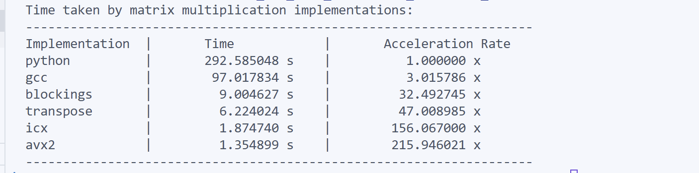

**Warning:** 本实验基于icx构建。如果需要在本地运行，请确保使用intel处理器并安装了icx编译器。如果没有安装，也可以使用仅使用gcc编译器的版本，但可能需要远多于icx版本的运行时间，并不保证得到相同的实验结果。另外，运行时需要使用python。请确定安装python3与numpy库。


**icx版本编译指令：**
```bash
mkdir build
./asm_icx.sh matrix_mul matrix_mul_avx2_kernel.s matrix_mul_avx2.c matrix_mul_c_blockings.c matrix_mul_c_gcc.s matrix_mul_c_icx.s matrix_mul_c_with_transpose.c matrix_mul_shell_4python.c matrix_mul_shell.c matrix_transpose_avx2.s
```
**仅gcc编译指令：**
```bash
mkdir build
gcc -Ofast -mavx2 -o build/matrix_mul_gcc matrix_mul_avx2_kernel.s matrix_mul_avx2.c matrix_mul_c_blockings.c matrix_mul_c_gcc.s matrix_mul_c_with_transpose.c matrix_mul_shell_4python.c matrix_mul_shell_no_icx.c matrix_transpose_avx2.s $(python3-config --embed --cflags --libs)
```


**各模块功能与简要描述：**
1. matrix_mul_shell.c:  
main 函数所在文件，调用所有不同函数实现并计时输出；带后缀 _no_icx 的版本除去了后面提到的第三个文件对应的函数，以兼容gcc下运行。

2. matrix_mul_c.c:  
naive 实现的矩阵乘法，只写了最简单的乘法逻辑。

3. matrix_mul_c_icx.s:  
基于第二个文件使用icx汇编出的汇编语言文件，参数如下：  
```bash
icx -S -O3 -xHost -fp-model=fast -qopt-zmm-usage=high -qopenmp -o matrix_mul_c_icx.s matrix_mul_c.c
```
需要处理器支持avx2。注意到实际上icx已经做到了叉积运算以及0-15号ymm寄存器联合运算，并且实现了粗略的blocking策略，但是由于最内层循环仍在频繁存取内存导致性能略有损耗，这将在输出报告部分再次提及。

4. matrix_mul_c_gcc.s:  
基于第二个文件使用gcc汇编出的汇编语言文件，参数如下：  
```bash
gcc -S -Ofast -mavx2 -o matrix_mul_c_gcc.s matrix_mul_c.c
```
需要处理器支持avx2。gcc的优化相对保守，也可能是我没有开足够的优化参数导致。只使用到两个ymm寄存器，可以作为c语言汇编速度的基准。

5. matrix_mul_python.py & matrix_mul_shell_4python.c:
前者是使用 python 的 numpy 库实现的矩阵乘法  
后者用于初始化 python 解释器并传递运行时间的 c 语言文件  
这部分计时工作由python文件完成。

6. matrix_mul_c_blockings.c:  
简单的分块逻辑，使用64*64的浮点数矩阵块来进行分块，优化了缓存管理

7. matrix_mul_c_with_transpose.c & matrix_transpose_avx2.s
在完成 naive 算法时，注意到后一矩阵需要竖着读取，这导致读入没用的数据块，因此使用之前写过的 avx2 的矩阵转置文件，先转置矩阵，再进行运算。

8. matrix_mul_avx2_kernel.s & matrix_mul_avx2.c
前者使用 8 * 8 小型浮点矩阵的叉积 avx2 运算逻辑  
后者使用 c 语言调度多级缓存，并将本来分离的内存区域（列向量不连续储存）写好线性连续储存内容再加入到 8 * 8 的逻辑核中，大大加快了速度。

**实验结果**：


根据实验结果，注意到 gcc 优化下比 python(numpy) 的性能强 3 倍左右。icx 优化速度惊人，达到 150x。avx2 的写法更进一步，进一步加快了速度，达到 200x。分块和转置的优化也有一定提升，但反常的是并不如 naive 的 gcc 快。可能原因是 icx 已经完成了叉乘优化，但是分块和转置编译器优化空间较窄，没有完全发挥性能。